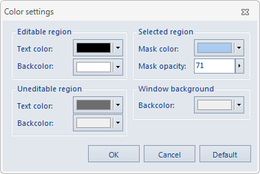

### Introduction

Users can set background colors for the editable area, non editing area, the 
window region, while supporting setting text color and the selected region 
mask color.

### Basic Steps

  1. Get attribute table: Right click a vector dataset in Workspace manager, Point to Browse Attributes on the context menu. if the dataset is a tabular dataset, double click it to open the attribute table.
  2. Click Attributes>System Settings>Set Color button to prompt Color settings dialog as below.
  
  3. When you set a background color or text color, click the drop-down button on the right side of the combo box, and then select the color you want in the pop-up color palette. Among them, the selected area is supported to set mask color transparency, by directly entering the value in the text box, or by moving the slider.
  4. Click "OK" to apply the color settings to all the attribute table. If you need to restore the default color settings, click the Default button in the dialog box. Attribute table color setting result is as shown below:

### Note

  1. It is a global setting, which is effective for all the attribute tables.

  

