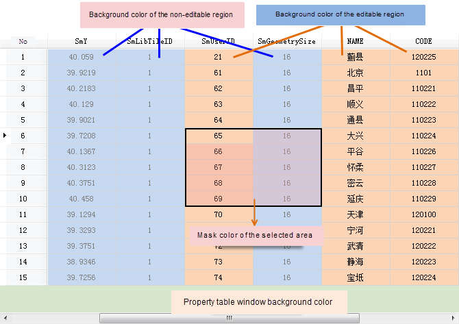

---
id: ColumnWidthSetting
title: Attribute Table Settings
---
The application supports hiding fields, setting the width of each column, and changing colors of all displays.

### Hide System Fields

Hides the system fields in an attribute table.

**Function Entrance**

* Click **Attribute Table** > **Settings** > **Hide System Fields**.
* Check the checkbox Hide System Fields on the left bottom of the attribute table window.

### Setting Column Width

Sets the column width of the attribute table.

**Function**

* Click Attribute Table > System Settings > Column Width to prompt the Column Width Settings dialog. To modify the width of some specific columns, select the entire column or any cell in the column, which can be used in conjunction with the CTRL or shift key to select, and then click the Column Width button. 

**Parameter Description**

There are three setting modes:

* **Suitable Column Width** : The column width will be automatically adjusted based on the length of the cell contents and the field name. 
* **Standard Column Width** : Attribute table column width is set to the standard width, SuperMap standard width is set to 100 pixels.
* **Custom Column Width** : Enter the number of pixels in the text box on the right side. The column width range is [2, +∞), the pixel unit is generally an integer, so the input width should be integer. 

If you check the "Only Modify Selected Column", these settings will only work on the selected column. Otherwise, they will affect all columns.

### Color Settings

Users can set background colors for the editable area, non editing area, the window region, while supporting setting text color and the selected region mask color.

**Function Entrance**

* Click Attribute Table > Settings > Color Settings.

**Parameter Settings**

* In the Color Settings dialog box, click the drop-down button on the right side of the combo box, and then select the color you want in the pop-up color palette. Among them, the selected area is supported to set mask color transparency, by directly entering the value in the text box, or by moving the slider.
* Click "OK" to apply the color settings to all the attribute table. If you need to restore the default color settings, click the Default button in the dialog box. Attribute table color setting result is as shown below:

### Note

It is a global setting, which is effective for all the attribute tables.

### Highlight Objects

After associating an attribute table with a map, you can check it to highlight all objects corresponding with the selected column on the map. If the data is very large or you associate an attribute table with a map, highlighting the objects is not good for the operation efficiency.

When associating an attribute table with a map, the map window won't highlight objects by default after selecting a whole column. You should right-click on the column and click **Highlight Objects**. This function doesn't apply to big data.

