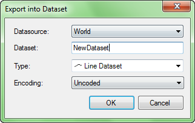

### Description

Export the attribute information of a vector dataset into a new dataset of the 
same type or a tabular dataset in records. Besides, you are allowed to export 
a tabular dataset into a new tabular dataset.

### Basic Steps

  1. Open an attribute table. you can right click a vector dataset in the Workspace Manager and click Browse Attributes.
  2. Select the records you want to export. A record is selected if a cell in the record is selected.
  3. On the Attributes tab, in the Export group, click Dataset to display the Export into Dataset dialog box, as shown below.
    * Fields information: Save the selected field value in the saved dataset.
    * Datasource: The datasource to place the new dataset.
    * Dataset: The name of the new dataset.
    * Type: The type of the new dataset. For a vector dataset, you can choose to export into a dataset of its own type or a tabular dataset. For a tabular dataset, you can only choose to export into a tabular dataset.
    * Encoding: The encoding type of the new dataset.

You can specify either the single-byte, double-byte, triple-byte or four byte encoding mode for the new dataset when exporting a non-point vector dataset.

  

  4. Click OK. The new dataset appears under the specified datasource in the Workspace Manager.

### Note

  1. All records are exported if there are no records selected.
  2. You will be prompted to change the name if you input an invalid name for the new dataset.
  3. You can perform the Export operation for one attribute table, the one in the current attribute table window, at a time.

  

