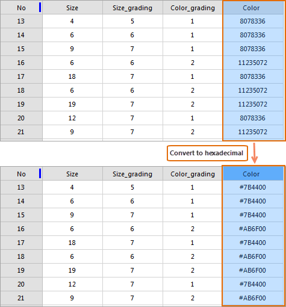

---
id: DisplayHexadecimal
title: Show Hexadecimal  
---  
### Instructions

Converts integer values to hexadecimal values to help people view or enter hexadecimal values. When you are editing a customized color, you can enter a hexadecimal color value directly into an attribute table.

The feature Show Hexadecimal only works on the integer field.

* Select the column and right-click. Then select **Show Hexadecimal** button.
  

* Click on the Show Hexadecimal button to revert to the decimal values.

 [Descending](SortOrderDescendingButton)

 [Hide Column](HideButton)

 [Show Hidden Column](CancelHideButton)

 [Filter](FilterButton)

 [Location](GoToButton)

