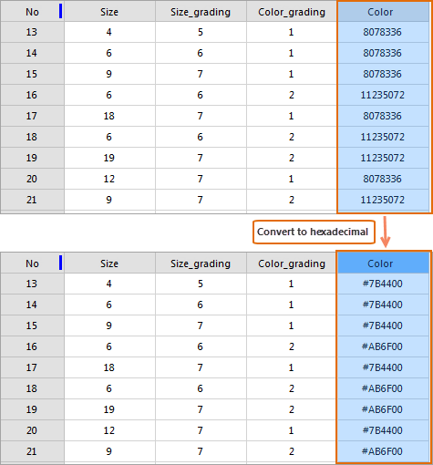

### Instructions

Converts numerals in the selected column to hexadecimal values to help people 
view or enter hexadecimal values. When you are editing a customized color, you 
can enter a hexadecimal color value directly into an attribute table.

### Basic steps

  1. In the Workspace, right click on your dataset and the select "Browse Attributes".
  2. In the attribute table, select the column required and then click on the Show Hexadecimal button.
  

  3. Click on the Show Hexadecimal button to restore numerals back to the decimal values.

### Note

The Show Hexadecimal button can work only when the type of select field is integer.

 [Sort Descending](SortOrderDescendingButton.htm)

 [Hide Column](HideButton.htm)

 [Cancel Hide](CancelHideButton.htm)

 [Filter](FilterButton.htm)

 [Positioning](GoToButton.htm)

