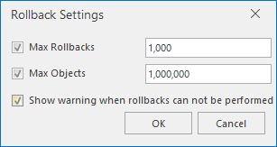

### Instructions

Modify the settings about rollbacks.

###  Basic steps

  1. Right-click your vector dataset, then select "Browse Attributes", if your dataset is a tabular dataset, you can double click to open it.
  2. In the "Attribute Table" tab, on the "Edit" group, click "Settings" button to open the "Rollback Settings" dialog box. 
  
  3. In the dialog box, you can set the number of maximum objects that can be rolled back, the maximum times of rollbacks and display Warning. Default rollback objects are 1000000, and rollback times are 1000. 

