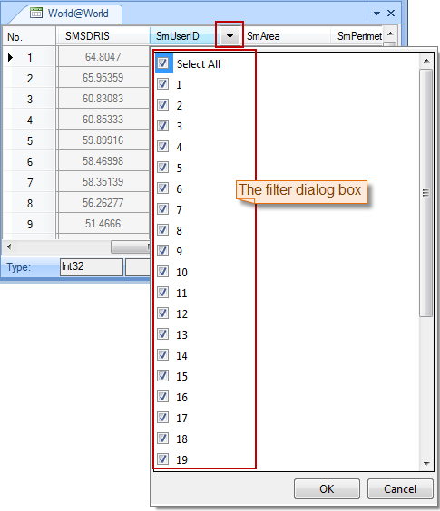

---
id: FilterButton
title: Filter  
---  
### Description

The Filters function can show the records you want and hide the rest in an attribute table.

### Basic Steps

1. Select one field or more fields by pressing Shift or Ctrl in the attribute table.
2. Click **Attribute Table** > **Browse** group > **Filter**.
3. Select the filter button next to the column header and check the boxes you want to show. Checking all means showing all values. Then select OK. 
  

4. To remove a filter from a column, you can select the column and click Filter again.

### Note

1. You can select multiple fields and click Filter to create a filter for each column.
2. Once you clear a filter from a column, you will lose all checking.

[Sort Ascending](SortOrderAscendingButton)

[Sort Descending](SortOrderDescendingButton)

[Hide Fields](HideButton)

[Show Hidden](CancelHideButton)

[Positioning](GoToButton)

 [Show Hexadecimal](DisplayHexadecimal)

