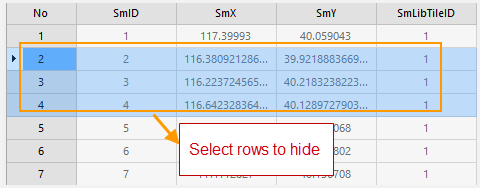
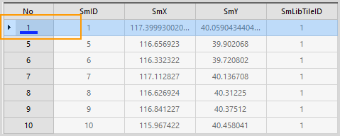

---
id: HiddenRows
title: Hide/Show Row  
---  
### Hide Row

Hides the selected rows.

**Basic Steps**

1. Select one row or more rows using Shift or Ctrl key.
2. Click **Attribute Table** > **Browse** > **Hide Row**. Or, you can right click and select **Hide Row**.
3. That selected row will not be displayed in the attributes table, the previous row will be selected, and a "Hide Row" mark will appear below the row.

**Note**

1. The Hide Row function won't be active until you select a row in an attribute table.
2. To display all hidden rows, you can use **Show Hidden Row**.
3. If you close the attributes table then open it again, it will show all rows and columns.

### Show Hidden Row

Displays all hidden rows. The feature won't be active until you select a row in an attribute table.

**Basic Steps**

1. Click **Attribute Table** > **Browse** > **Show Hidden Row**. Or, you can right click and select **Show Hidden Row**.
2. All hidden rows are visible and the hidden icon disappears.

  
 [Sort Ascending](SortOrderAscendingButton)

 [Sort Descending](SortOrderDescendingButton)

 [Hide Column](HideButton)

 [Show Hidden Columns](CancelHideButton)

 [Show Hidden Rows](CancelHideRows)

 [Filter](FilterButton)

 [Locate](GoToButton)

 [Show Hexadecimal](DisplayHexadecimal)

