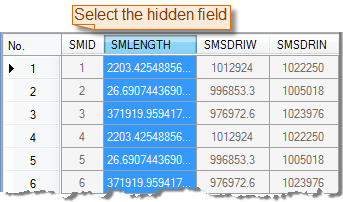
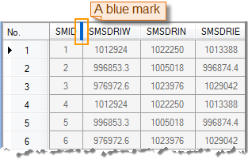

### Description

Hide the selected field or fields.

### Basic Steps

  1. Open an attribute table. you can right click a vector dataset in the Workspace Manager and click Browse Attributes. Or double-click the pure attribute table dataset.
  2. Select one or more fields in the attribute table. To select multiple fields, you can continuously click the field name while holding down the Shift or Ctrl key.
  3. On the Attributes tab, in the Browse group, click Hide Fields.
  4. The selected fields are hidden. Meanwhile, the field on the left of the hidden field is highlighted and a blue mark appears at the head of the field.

  
 

### Note

  1. The Hide Fields command is only active if there are selected fields in the current attribute table.
  2. To unhide the fields that you have hidden, use the [Show Hidden Fields](CancelHideButton.htm) button.
  3. Closing the property sheet and opening it again will not preserve the previous hidden row or hidden column operation and will display all row and column information in the property sheet.

 [Sort Ascending](SortOrderAscendingButton.htm)

 [Sort Descending](SortOrderDescendingButton.htm)

 [Show Column Hidden](CancelHideButton.htm)

 [Hide Row](HiddenRows.htm)

 [Show Hidden Rows](CancelHideRows.htm)

 [Filter](FilterButton.htm)

 [Go To](GoToButton.htm)

 [Show Hexadecimal](DisplayHexadecimal.htm)

