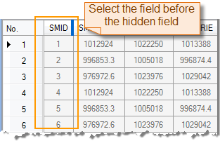

---
id: HideButton
title: Hide/Show Column  
---  
### Hide Column

Hides the selected columns.

**Basic Steps**

1. Select one column or more columns using Shift or Ctrl key.
2. Click **Attribute Table** > **Browse** > **Hide Column**. Or, you can right click and select **Hide Column**.
3. That selected column will not be displayed in the attributes table, the previous column will be selected, and a mark will appear beside the column.

  
**Note**

* The Hide column function won't be active until you select a column in an attribute table.
* To display all hidden columns, you can use **Show Hidden Column**.
* If you close the attributes table then open it again, it will show all columns and rows.

### Show Hidden Column

Displays all hidden columns. The feature won't be active until you select a column in an attribute table.

**Basic Steps**

1. Click **Attribute Table** > **Browse** > **Show Hidden Column**. Or, you can right click and select **Show Hidden Column**.
2. All hidden columns are visible and the hidden icon disappears.

  
 [Sort Ascending](SortOrderAscendingButton)

 [Sort Descending](SortOrderDescendingButton)

 [Show Column Hidden](CancelHideButton)

 [Hide Row](HiddenRows)

 [Show Hidden Row](CancelHideRows)

 [Filter](FilterButton)

 [Locate](GoToButton)

 [Show Hexadecimal](DisplayHexadecimal)

