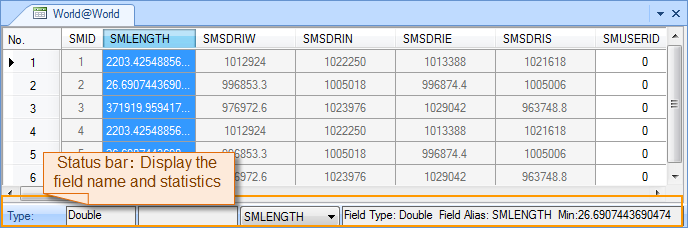

### Description

Find the minimum among all values in the selected field.

### Basic Steps

  1. Right click a vector dataset in the Worksspace Manager and click Open Attributes to open the attribute table of the dataset. Or double-click the pure attribute table dataset.
  2. Select a numeric field in the attribute table.
  3. On the Attributes tab, in the Statistics group, click the Min button.
  4. The field type, alias and the minimum of all values in the filed are displayed on the status bar at the bottom of the attribute table window. 

You can also select multiple numeric fields in the attribute table and click the Min button to calculate the maximums of these fields together. The minimum of the leftmost selected field in the attribute table is displayed on the status bar. 
To view the minimum of another field, click the drop-down arrow of the combo box displaying the field name on the status bar and click the field whose minimum you want to view.

  

### Note

  1. The Min button is only active if there are selected fields in the attribute table.
  2. If you select a non-numeric field and click the Sum button to calculate the sum for the values in the field. You will be prompted to select a numeric field.

[Sum](SumButton.htm)

[Average](AverageButton.htm)

[Max](MaxButton.htm)

[Variance](VarianceButton.htm)

[Standard Deviation](StdDeviationButton.htm)

[Unique Count](CountOfValueButton.htm)

