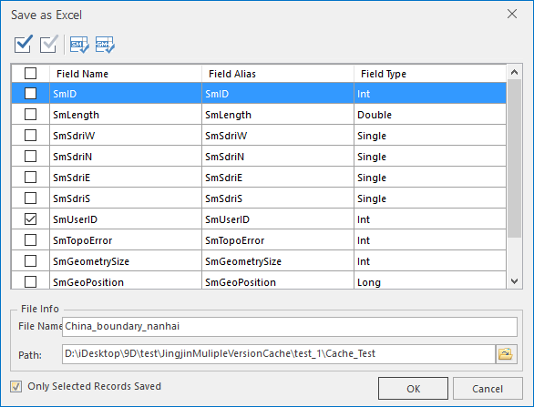

### Introduction

Save the attribute table of the vector dataset or tabular dataset as Excel. It supports saving overall attribute table or selected records as Excel.

### Basic Steps

  1. Right click a vector dataset and point to Browse Attributes on the context menu; if the dataset is a tabular dataset, double click it to open the attribute table.
  2. If you only want to export the selected records, select the records in the attribute table, where Ctrl and Shift keys can be used for the selection.
  3. Click Attributes>Export>Save as Excel, or right click the attribute table and point to Save as Excel, it will prompt the Save as Excel dialog. The parameters are set as follows:
    * **Filed list** : Check fields you want to export in the field list. You can select fields with the tools in the toolbar. The non-system fields are selected by default. 
    * File name: output Excel file name.
    * Path: the path the result is stored in.
    * Only selected records saved: check this to only save the selected records as Excel; otherwise, save overall records to Excel.
  

  4. Click OK to finish.

###  Note

  1. If you have not selected the attribute table cells, it will save all the records.
  2. The user can simultaneously open several attribute tables, but only the current one can be saved as Excel.

