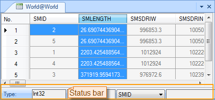

### Description

Sort records in ascending order based on the selected field.

### Basic Steps

  1. Open an attribute table. you can right click a vector dataset in the Workspace Manager and click Browse Attributes. Or double-click the pure attribute table dataset.
  2. Select a field and click Sort Ascending to sort records in ascending order based on the field.

If multiple fields are selected before clicking Sort Ascending, the records will be sorted by the leftmost selected field. To view the information of a field, display the field in the drop-down list on the status bar below the attribute table.

  

### Note

  1. The Sort Ascending command is only active if there are selected fields in the current attribute table.
  2. The sort operation cannot be undone once performed.

 [Sort Descending](SortOrderDescendingButton.htm)

 [Hide Fields](HideButton.htm)

 [Cancel Hidden](CancelHideButton.htm)

 [Filter](FilterButton.htm)

 [Go To](GoToButton.htm)

 [Show Hexadecimal](DisplayHexadecimal.htm)

