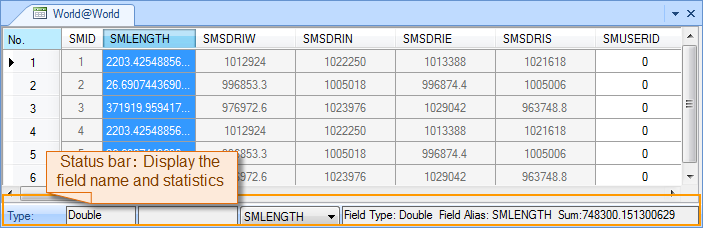

---
id: StatisticAnalystgroup
title: Statistic Group  
---  
Both the **Statistic** group on the **Attributes** tab and on the context menu of an attribute table provide 7 statistic functions for attribute information of vector datasets. We describe them in the following content.

Statistic Analysis Type | Description  
---|---  
Sum | Counts the sum of the selected items in a field or a column.  
Mean | Counts the mean of the selected items in a field or a column.  
Max | Finds the maximum value of the selected items in a field or a column.  
Min | Finds the minimum value of the selected items in a field or a column.  
Variance | Counts the variance of the selected items in a field or a column.  
Standard Deviation | Counts the standard deviation of the selected items in a field or a column.  
Count Unique | Counts the number of unique values of the selected items in a field or a column.  
  
The operation steps are the same for each statistical function. Here we take **Sum** as an example

**Function Entrances**

Open your attribute table and select the field you want. Please notice that the field must be numerical.

Click **Attribute Table** > **Statistic** > **Sum**. Or right-click on your attribute table and select **Statistic** > **Sum**. Both the status bar and the output window will display the result.

  
