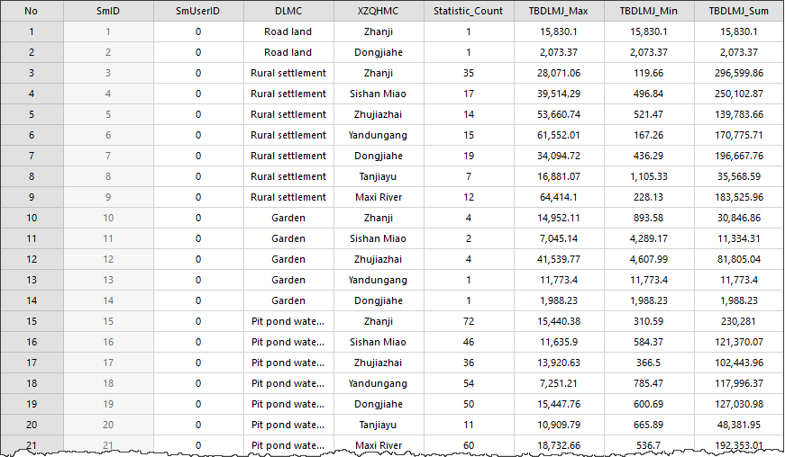

### Instructions

Summarizes data in a table to get new statistical information you want. The summary statistics will be saved in a new tabular dataset.

You can specify multiple fields to summarize. The result table can be exported for other use. For instance, you have land use data. You can use the feature to summarize kinds of data like slope, quality classification, cropland, and so on without setting statistical conditions several times.

**Instance**

We take the sample data ThemeMap\Land Use\Land Use.udb as an example to describe the feature.

### Basic steps

1. Open the data source Land Use.udb. Select the dataset JSTB and click **Browse Attribute Table** in the context menu. 
2. Click the **Attribute Table** tab > **Statistic** group > **Summary Field** button. Or right-click your mouse in the attribute table window and select **Statistic** group > **Summary Field**. The dialog Summary Field appears.
3. Set the following parameters in the dialog box. 
* **Source Data** : Set data to involve the calculation by entering a filter express and group fields. 
  * **Filter** : Build a filter expression to specify data to involve the calculation. On how to construct SQL expressions, please refer to [SQL Query](../../Query/SQLQuery).
  * **Group by** : The parameter is optional. If you do not specify any field, the result table contains only one record. If you specify one group field, every group corresponds with a summarized result. If you specify two group fields, the application will group values of the second group field based on the first group, and so on. Such as specifying two group fields XZQHMC (name of the administrative area) and DLMC (land name), the application will group the XZQHMC field values, and then group the DLMC field values based on the first group.
* **Summary Field** : All fields of the dataset are listed here. 
  * **Select field** : to select the field to involve the statistic, check the checkbox corresponding with the field. Here, we check the field TBDLMJ (land area). 
  * **Statistics Type** : the supported statistical operations include Max, Min, Sum, Mean, Standard Deviation, and Variance. Here, we set the statistics type to Max, Min, and Sum.
  * Naming conventions adopted by iDesktop are 'field'_Max, 'field'_Min, 'field'_Sum, 'field'_Average, 'field'_StdDeviation, and 'field'_Variance. Among them, 'field' is the name of the field involved the statistical calculation.
* **Target Data** : specify a datasource and a dataset to save the result data.
4. Click OK to perform the calculation. The statistical result is shown below. 

The field **Statistic_Count** records the number of each unique value. Fields **TBDLMJ_Max** , **TBDLMJ_Min** , and **TBDLMJ_Sum** are the statistical result.

