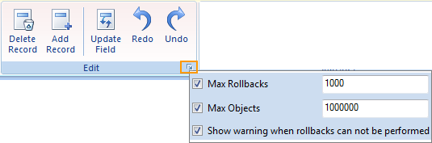

### Description

The Undo button erases the last change done to the attribute table and the Redo button does the last undone action over. Their functions are the same with those in the Update Field dialog box.

As shown below, you can change the rollback settings in the dialog box for the Edit group.

  

  
  * Max Rollbacks: Check the box to enable the setting for the max number of redo and undo actions. 

You will not be able to roll back to the actions beyond the max number of rollbacks allowed.

When updating the attribute information in the Update Field dialog box, you will be notified that you will not be able to roll back to the most previous action if you have reached the max number of rollbacks, and you will be asked whether to continue. Click Yes to continue and No to cancel the action.

  * Max Objects: Check the box to enable the setting for the max number of objects allowed for one rollback. 

When updating the attribute information in the Update Field dialog box, you will be notified that you will not be able to undo this action if you have reached the max number of objects allowed for a rollback, and you will be asked whether to continue or not. Click Yes to continue and No to cancel the action.

  * Show warning: Check the box to show warning when the Max Rollbacks and Max Objects have been reached. 

When unchecked, the action will not be performed if you have reached the max number of rollbacks or objects.

###  Related Topics

 [Copy and Paste](CopyAndPaste.htm)

 [Drag and Drop](DragTabular.htm)

 [Delete Record](DeleteRecordsButton.htm)

  [Add Rows](AddRecordsButton.htm)

 [Update Column](UpdateButton.htm)

 [Binary Edit](BinaryEdit.htm)

  

