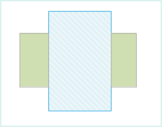
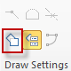
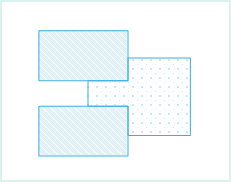
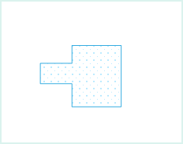

### Introduction

Auto Split Region is used to cut the intersection part of the current region object and the other regions when drawing region objects. The new object got may be a single object or a complex region object.

  * Auto Split Region functionality applies to region layer or CAD layer.
  * If the new object drawing intersects with other objects in the layer, the new object will be cut, the intersection part will be cut away and a new object will be created.
  * If the new object drew does not intersect with any object, no region object will be split, that is retain the object drew.
  * If the new object crosses an existing region object, a complex region object will be created, that is a region object with subobjects. As shown below, the new region object drew (dotted line rectangle) crosses another region object (filled rectangle), the result will be a complex object that contains 2 subobjects.
 |   
 

### Basic Steps

  1. In the Object Operation tab, click Drawing > Drawing Settings, and select Auto-Split Region from the drop-down list. You can also press the prompt keys of "Shift+R" to activate the function.
  2. When the icon turns , it means the Auto Cut Region function enabled; If you want to cancel this function, click this function again.
  3. Draw a region object in the current editable layer. As shown in figure1, draw a rectangle object (in dotted line).
  
 
Fig1 Draw rectangle object  
  4. The rectangle intersects with other two rectangles, the new rectangle (dotted line rectangle) will be split by the other two rectangles and a new object will be got, as shown in fig2.
  
Fig2 Split the rectangle object  
  5. The new object after moving, as shown in figure3.
  

Fig3 Split result  
  6. To disable the functionality, just uncheck the Auto Split Region.

