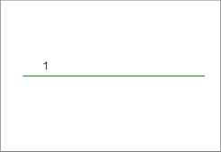

### Introduction

Auto-Split Line is used to split the original object and the new line at the intersection and create several line objects

* Auto Split Line supports line layers and CAD layers.
* The operation step of auto split line is shown in the figure below. 

Draw a line object intersects with the line in fig1, the fig2 shows the result when Auto Split Line is disabled, the fig3 shows the result when Auto Split Line is enabled.

The original line object (Line1 in fig1) will be deleted after split, the
system fields of the new line objects (Line3 and Line4 in fig3) created will
be assigned by the system, non-system fields and field SmUserID will retain
the corresponding attribute of the original line object. The attribute
information of the line object drew (line5 and line6 in fig3) will be added to the attribute table with the drawing order.

* If the line object drew intersects with a complex line object (original object), or a line object with several subobjects, the new line object drew will be split at the intersection, the original object is still complex object, but new subobjects will be created at the intersection. You can select the objects, right click and select Properties to view its information.
* If the new object drew doesn't intersect with any line objects, the line drew will be retained even the Auto Split Line is enabled.

### Basic Steps

1. Click **Object Operations** > **Drawing** group > **Drawing Settings** > **Auto-Split Line**. You can also press Shift+K to activate this function. Click on this function again to disable it.
2. Draw a line object in the current editable layer. The new object drew and the original object will be split into several objects at the intersection.

