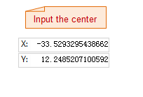

### Introduction

Create circle with several methods. Such as specify the center, radius, diameter, the points on the circumference, etc. The application provides five methods for drawing the circle, the default method is specify the center and the radius.

### Basic Steps

**Draw circle with the center and radius**

1. Click **Object Operations** > **Drawing** group > **Region** > **Center, Radius**.
2. Move the cursor to the map window, you can see that the parameter input box will display the coordinate value of the current cursor when the cursor moves. Input the coordinate value of the center in the input box (you can swap between the two parameter input boxes with the Tab key), press Enter key to input the center of the circle.
3. Move the cursor again and input the radius (length) in the parameter input box, press Enter key to finish the drawing.

**Draw circle with diameter**

1. Click **Object Operations** > **Drawing** group > **Region** > **Start, Diameter**.
2. Move the cursor to the map window, you can see that the parameter input box will display the coordinate value of the point when the cursor moves. Input the coordinate value of the start point of the diameter in the input box (you can swap between the two parameter input boxes with the Tab key), press Enter key to input the start point of the diameter.
3. Move the cursor, you can see that the length of line form the cursor to the start point of the diameter and the angle between the it and the X-axis is displayed in real time in the map window (you can swap between the two parameter input boxes by pressing the Tab key), input the length and angle value in the parameter input box.
4. After the diameter is input, press Enter to finish the drawing.

**Draw circle with two points on the circumference**

1. Click **Object Operations** > **Drawing** group > **Region** > **2 Points**.
2. Move the cursor to the map window, you can see that the parameter input box will display the coordinate value of the current cursor when the cursor moves. Input the coordinate value of a point on the circumference in the input box (you can swap between the two parameter input boxes with the Tab key), press ENTER key to input the point on the circle.
3. Move the cursor, input the coordinate of another point on the circumference in the parameter input box (you can swap between the two parameter input box with the Tab key). 
4. Press Enter, a circle object will be drew with the line between the two points as the diameter.

**Draw circle with three points on the circumference**

1. Click **Object Operations** > **Drawing** group > **Region** > **3 Points**.
2. Move the cursor to the map window, you can see that the parameter input box will display the coordinate value of the point when the cursor moves. Input the coordinate value of a point on the circumference in the input box (you can swap between the two parameter input boxes with the Tab key), press ENTER key to input the first point on the circle.
3. Move the cursor, input the coordinate value of the second point on the circumference in the parameter input box (you can swap between the two parameter input boxes with the Tab key), press Enter key to input the coordinate of the second point.
4. Move the cursor, input the coordinate value of the third point on the circumference in the parameter input box (you can swap between the two parameter input boxes with the Tab key), press Enter key to draw the circle that passes the three points.

**Draw the circumscribed circle of a rectangle**

1. Click **Object Operations** > **Drawing** group > **Region** > **Circumcircle of Rectangle**.
2. Move the cursor to the map window, you can see that the parameter input box will display the coordinate value of the point when the cursor moves. Input the coordinate value of the start point of the rectangle in the input box (you can swap between the two parameter input boxes with the Tab key), press ENTER key to input the start point of the rectangle.
3. Move the cursor, the height and width of the rectangle will be displayed in the parameter input box (you can swap between the two parameter input boxes with the Tab key), input the values.
4. Press Enter and the circumscribed circle of the rectangle will be input.

### Note

The circles in a line dataset are all common line objects, only recording the coordinates of nodes on lines. But the circles objects drew in a CAD dataset are the parameterized objects that will record the corresponding parameters, such as the radius and center, etc.

