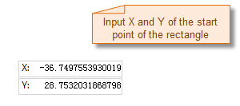

### Introduction

Ellipse command is used to create an ellipse object. The application provides two methods to draw the ellipse object: draw the inscribed ellipse of rectangle or draw oblique ellipse with sem-imajor axis and semi-minor axis.

### Basic Steps

**Draw the inscribed ellipse of rectangle**

1. In the Object Operations tab, click the Region button in the Draw group. Select Inscribed Ellipse, and the ellipse cursor appears.
2. Move the cursor to the map window, the coordinate value of the current location will be displayed in the parameter input box when moving the cursor. Input the coordinate of the start point of the ellipse (you can switch between the two parameter input boxes by pressing the Tab key), the press Enter key to confirm the location of the ellipse.
3. Move the cursor and you can see the size of the blue ellipse changes with the moving of the cursor. The height and width of the rectangle are displayed in real time with the move of the cursor, input the parameter value in the box behind it, press Enter to locate the ellipse. 

Note: If you press and hold the Shift key, you will get a circle, that is the width and the height of the rectangle will be the same.

4. Right click to cancel the current drawing operation.
 

**Draws an oblique ellipse**

1. In the Object Operations tab, click the Region button in the Draw group. Select Oblique Ellipse, and the ellipse cursor appears.
2. Move the cursor to the map window, the coordinate value of the current location will be displayed in the parameter input box when moving the cursor. Input the start point coordinate of a semiaxis (sem-imajor axis or semi-minor axis) of the ellipse (you can switch between the two parameter input boxes by pressing the Tab key), the press Enter key to confirm the location of the ellipse semiaxis.
3. Move the mouse,the length of the line connecting the location of the cursor and the starting point of the semiaxis and the angle between it and the positive X axis will be displayed in the map window in real time (you can switch between the two parameter input boxes by pressing the Tab key), input the length and angle, press Enter to finish the drawing of a semiaxis of the oblique ellipse.
4. Move the cursor, the length of the line connecting the start point of the semiaxis and another semiaxis will be displayed in the map window, input the length of the semiaxis, press Enter to finish the drawing of the oblique ellipse.
5. Right click to cancel the current drawing operation.

### Note

The ellipses in the line dataset are all common line objects. It only records the coordinates of nodes on line. But the ellipse objects drew in the CAD dataset are the parameterized objects. It will record the corresponding parameters, such as the major axis, minor axis and center etc.

