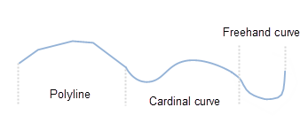

### Introduction

Draw a continuous line object with multiple types of line segments which can be Polyline, Cardinal, and Freehand Line. The line types can be switched in the process of drawing. It is mainly used to draw linear features, such as rivers, railways, roads, power lines, etc..

### Basic Steps

  1. Click Object Operations>Drawing>Drawing Settings, and then select Draw Polyline in the drop-down list.
  2. At this time, the mouse state becomes Draw Polyline, click Draw>Curve drop-down list and choose Cardinal or Freehand Line to draw curve type.
  3. Move the mouse on the map window and click to start drawing, and then click to determine the next node position one by one.
  4. During the multiline drawing process, click the button on Draw group to switch the multi section line type, and then move the mouse to the map window to continue drawing, right click to end the current drawing operation.
  
 
Multiline  

###  Note

Parametric drawing is not supported for this function.

###  Related Topics

 [Draw Polyline](DrawPolyLine.htm)

 [Draw Curve](DrawCurve.htm)

