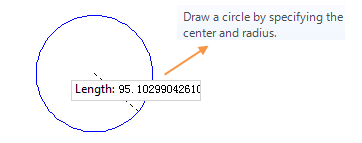

### Introduction

Draw arc, the arc can be determined by parameters like center, end point, start point, radius, angles. You can draw the arc with several ways. The application provide several ways to draw the arc, circular arc, 3 points arc and ellipse arc.

The arc object is a part of the ellipse object, so it is needed to draw a arc object before drawing a sector object.

### Basic Steps

**Draw arc by specify 3 points (3-point arc)**

1. Set the current layer as editable. In the Object Operations tab, Click the Line dropdown list in the Draw group. Select Triple Points Arc, and the 3-point arc appears.
2. Move the cursor to the map window, you can see that the parameter box will display the coordinate value of the current location when the cursor moves in the map window. Input the coordinate value of a point on the 3-point arc in the setting box (you can swap between the two parameter input boxes with the Tab key), press ENTER key to input the 3-point arc.
3. Move the cursor, input the coordinate of the second point in the input box, press Enter.
4. Move the mouse, input the coordinate value of the last point, press Enter to finish the drawing.
5. Right click to cancel the current drawing operation.

**Draw arc by specify start point, center and angle (circular arc)**

1. In the Object Operation tab, click the Line dropdown button in the Draw group. Select the Circular Arc, and the circular arc cursor appears.
2. Move the cursor to the map window, you can see that the parameter input box will display the coordinate value of the point when the cursor moves. Input the coordinate value of the start point in the input box (you can swap between the two parameter input boxes with the Tab key), press ENTER key to input the center. 
3. Move the cursor again and input the radius (length) of the circle in the parameter input box, press Enter key to finish the drawing.
4. With the circle drawn as the reference, move the cursor, input the start angle in the parameter input box behind it (the start angle is the included angle between the x-axis positive direction and the anti-clockwise direction of the starting radius or the arc), identify the starting location of the arc.
5. move the cursor, input the angle wept in the parameter input box behind it, press Enter.

**Draws an ellipse arc**

1. Set the current layer as editable. In the Object Operations tab, click the Line dropdown list in the Draw group. Select Ellipse Arc, and the ellipse arc appears.
2. Move the cursor, input the start point coordinate of a obliquely elliptic semiaxis (sems-minor axis or semi-minor axis) in the parameter input box, (you can switch between the two parameter input boxes by pressing the Tab key), press Enter. 
3. Move the mouse,the length of the line connecting the location of the cursor and the starting point of the semiaxis and the angle between it and the positive X axis will be displayed in the map window in real time (you can switch between the two parameter input boxes by pressing the Tab key), input the length and angle, press Enter to finish the drawing of a semiaxis of the oblique ellipse.
4. Move the mouse, input the length of another semiaxis, press Enter.
5. Move the cursor, input the start angle in the parameter input box behind it (the start angle is the included angle between the x-axis positive direction and the anti-clockwise direction of the starting radius or the arc), identify the starting location of the arc.
6. Move the cursor, input the angle wept in the parameter input box behind it, press Enter.

### Note

The arcs in the line dataset are all common line objects. It only records the coordinates of nodes on line. But the arc objects drew in the CAD dataset are the parameterized objects. It will record the corresponding parameters, such as the radius and center, etc.

