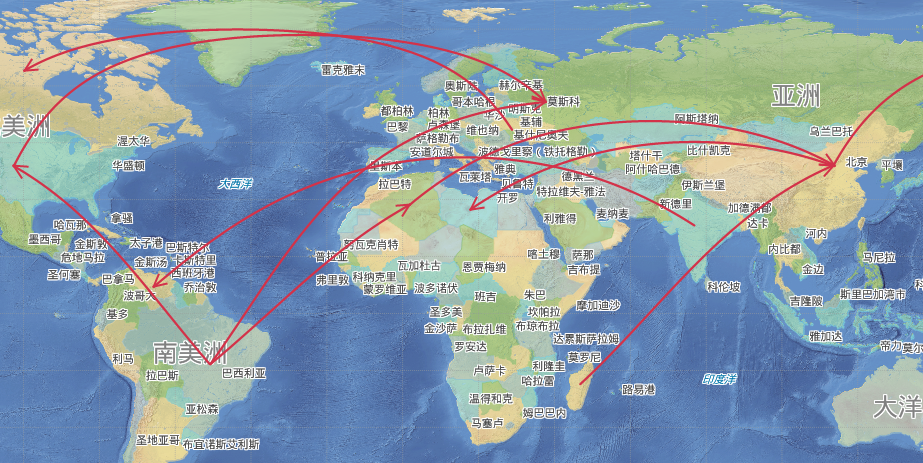

### Introduction

The application supports several kinds of curves, like bezier curve, B-splint curve, cardinal curve, freehand line and Geodesic

### Basic Steps

**Draw bezier curve**

The direction of bezier curve is controlled by two starting points and two ending points that are not on the curve, the midpoints are fit out by the other control points on the curve. At least 6 control points are needed to draw a bezier curve.

  1. In the Object Operations tab, click the Line dropdown list in the Draw group. Select Bezier, and the bezier curve cursor appears.
  2. Move the cursor to the map window, you can see that the parameter input box will display the coordinate value of the current cursor when the cursor moves. Input the coordinate value of the first control point on the bezier curve in the input box (you can swap between the two parameter input boxes with the Tab key), press ENTER key.
  3. Input the coordinate of the second, third and forth points, the coordinate value of the four control points determine the direction of the bezier curve.
  4. Input the coordinate of the fifth control point on the curve, a blue dotted line will appear between the third control point and the fourth control point, it is the first line segment fitted on the bezier curve.
  5. Input the coordinate of the sixth control point to draw the second line segment on the bezier curve.
  6. Repeat the steps above to draw other line segments on the bezier curve.
  7. Right click to finish the current drawing.

**B Splines**

B Splines are drawn with the start and end control points and the medium control points not on the curve. The other points on the curve are all fit by the medium control points on the curve. At least 4 control points are needed to finish the drawing of a B-spline.

  1. In the Object Operations tab, click the Line dropdown list in the Draw group. Select BSpline, and the Bspline cursor appears.
  2. Move the cursor to the map window, you can see that the parameter input box will display the coordinate value of the current cursor when the cursor moves. Input the coordinate value of the first control point on the curve in the input box (you can swap between the two parameter input boxes with the Tab key), press Enter key.
  3. Input the coordinate of the second point on the curve.
  4. Input the coordinate of the third control point on the curve, a blue dotted line will appear between the second control point and the third control point representing the first line segment on the B Spline curve.
  5. Input the coordinate of the forth control point on the curve, a blue dotted line will appear between the third control point and the fourth control point representing the second line segment of the B Spline curve.
  6. Repeat the steps above to draw other line segments on the B Spline curve.
  7. Right click to finish the current drawing.

**Cardinal curves**

Cardinal curves are determined by the control points on the curve, the other points on the curve are fitted by all the control points. At least 3 control points are needed to finish the drawing of a Cardinal curve.

  1. In the Object Operations tab, click the Line dropdown list in the Draw group. Select Cardinal, and the cardinal curve cursor appears.
  2. Move the cursor to the map window, you can see that the parameter input box will display the coordinate value of the current cursor when the cursor moves. Input the coordinate value of the first control point on the curve in the input box (you can swap between the two parameter input boxes with the Tab key), press Enter key.
  3. Input the second control point, you can see a blue dotted line appears between the two points.
  4. Move the cursor, input the coordinate of the third control point, the second blue dotted line appears between the second control point and the third control point.
  5. Right click to finish the current drawing.

**Freehand Line**

Freehand Line is got by dragging the cursor freely. It is very useful for creating irregular boundary and tracing with digitizer.

  1. In the Object Operations tab, click the Line dropdown list in the Draw group. Select Freehand Line, and the Freehand Line cursor appears.
  2. Move the cursor to the location of creating Freehand Line, click, hold the left mouse key and move the cursor to draw a curve the same with the path of the cursor.
  3. Right click to finish the operation.

**Geodesic**

Geodesic is the curve of the earth's surface radian. It can show the shortest distance between any two points on the surface most precisely. It is used in mapping the global route of sea or air. Enable the [Global Browsing](../../../Visualization/BrowseMap/Pan.htm#3) to operate.

Take an example of drawing the air line to show this function:

  1. Open the sample data World.smwu and "World_Day". Add the route dataset to the map.¡¡Set the line data editable.
  2. In the Object Operations tab, click the Line dropdown list in the Draw group. Select Geodesic, and the Geodesic cursor appears.
  3. Click the mouse in the starting and ending points of the route, and click the right mouse button to end the drawing. The following is the result:
  
Figure: Route chart  

