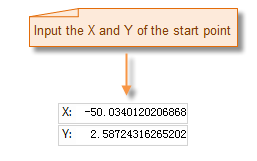
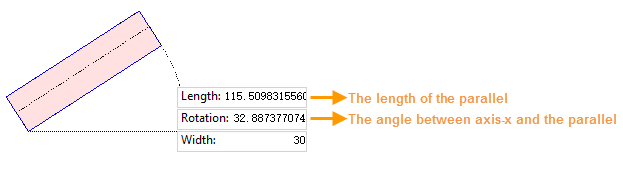
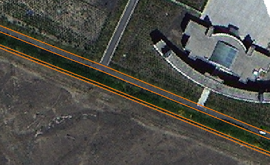

Basically, parallel lines are used for describing parallel features like railways, roads, power lines etc. You can draw parallel lines through: **specifying coordinate values** or **length and angle**. 

You can specify how many pairs of parallel lines you want to draw and the distance between two adjacent lines with the feature **Multiple Parallels**.

You are allowed to set steps anytime to increase or decrease the width between two adjacent parallel lines during the drawing process.

###  Draw parallel lines

**By entering coordinate values**

1. Click **Object Operations** > **Drawing** group > **Line** > **Parallel**.
2. **Set the starting point** : Move your mouse into the map window, and then you can click Tab key to focus the cursor on the coordinate X or Y box, and then you can type the values of X and Y and click Enter key.
3. **Set the width between two lines** : After the starting point is confirmed, a width text box appears, and you can click Tab to focus the cursor on the text box and then type the distance between parallel lines you want to draw and click Enter key.

4. Continue moving your mouse in the map window, the values of coordinate X, Y and Width at the position of the cursor are shown, and you can click Tab continuously to focus the cursor on any one of the three text boxes thereby confirm the next vertex you want to draw. 
5. The distance between two parallel lines can be increased or decreased by clicking the "Q" or "+" key in your keyboard. But the operation will take one line as a base line like the line 1 in the following picture, then adjust another line like the line 2. You can set the increase ways of the step size and the increasing value in the Setting Step Value dialog box.

* **Increase by Percentage** : You can type a value. Default is 20%, that means the width will increase (clicking "Q" or "+") or decrease (clicking "W" or "-") by 20% of the current width. For example, if the current width is 100 meter, the result width will be 120 meter by clicking Q once, and 144 meter by clicking Q twice.
* **Increase by Fixed Step** : You can type a value. Default is 2 meter, that means the width will increase (clicking "Q" or "+") or decrease (clicking "W" or "-") 2 meter. For example, if the current width is 100 meter, the result width will turn into 98 meter by clicking "W" once. 
6. You can change the drawing direction with the shortcut key "Ctrl R". The program will focus your cursor on another end of the drawing parallel, and then you can continue drawing the parallel along the opposite direction.

**Note** : When drawing parallel lines as a certain width, all lines are parallel. But if you increase or decrease continuously the width between adjacent lines, the lines will not be parallel. As following picture shows, when the width is changing from 9 meter to 30 meter, the drawn lines are not parallel.

7. Right click your mouse to finalize the operation.

**By entering a length and an angle**

1. Click **Object Operations** > **Drawing** group > **Line** > **Parallel (Length, Angle)**.
2. Confirm the starting point and width of parallel lines, the operation is similar to the way mentioned above.
3. A box containing the length from starting point to the cursor position, the angle between the parallel lines and X-axis positive direction, and the width appears. You can click the Tab key to focus on the box, and then you can type the length and the angle you want and click Enter.
4. You can specify a step size, the operation ways are the same with them mentioned above.
5. Right click your mouse to finalize the operation.

###  Draw multiple parallel lines

You are allowed to specify how many pairs of parallel lines you want to draw, and the distance between any two adjacent lines. For example, you can draw a road, a ditch and a woodland at the same time which can help you save time a lot meanwhile improve your work efficiency.

1. Click **Object Operations** > **Drawing** group > **Line** > **Multiple Parallels**.
2. Specify the starting point of parallel lines you want to draw.
3. With the shortcut keys "Ctrl Q" and "Ctrl W", you can specify the width of which pair of parallel lines will be changed. The width of the pair of parallel lines can be adjusted when the area between them are red. 

4. The values of coordinate X, Y at the cursor position and width of the adjustable parallel lines will be shown instantly, you can enter any value to confirm the next vertex. And all shortcuts mentioned above can be used.
5. The procedure of drawing multiple pairs of parallels is the same with drawing a pair of parallel lines. Also, you can change the drawing direction by clicking Ctrl R. 
6. Right click your mouse to finalize the operation.

###  Note

* If the application does not response when you want to increase or decrease the distance between two parallel lines through the shortcuts after you set a step size, you can move your map to make the cursor focus on the map window.

**All shortcut keys to draw parallel lines**

Shortcuts | Description
---|---
W or - | Reduce the step size
Q or + | Increase the step size
Ctrl+R | Focus your cursor on another end of parallel lines
Ctrl+Z | Undo the last operation
Ctrl+P | Open the "Setting Step Value" dialog box
Ctrl+E | Show or hide the parallel lines whose width can be adjusted.
