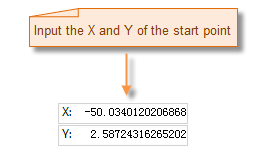

### Introduction

Polyline command is used to create polyline. Line object is mainly used to represent line features, like river, railway, road, wire etc. The application also provide multiple kinds of methods to draw polylines.

### Basic Steps

**Draw polyline by inputing coordinate values.**

1. In the Object Operations tab, click the Line button in the Drawing group then select "Polyline".
2. Move the cursor to the map window, you can see that the parameter box will display the coordinate value of the point when the cursor moves. Input the coordinate value of one of the node of the polyline in the input box (you can swap between the two parameter input boxes with the Tab key), press ENTER key to input the start location of the polyline.
3. Move the cursor and input the coordinate value of the next node in the parameter box, press Enter to finish the drawing of the first line segment of the polyline.
4. Move the cursor to the proper location, input X and Y coordinate, press Enter to draw the next line segment of polyline.
5. Repeat the last step to draw other line segments. 
6. Right click to finish the current drawing operation.

Note: When input value into the editing parameter box, the input box will be locked, that is the value in the parameter input box will not change when the mouse moves, only the input value is displayed; you can switch the focus between the x-coordinate and y-coordinate input box by pressing the Tab key. You can cancel the current parameter input box lock state by pressing the Esc key.

**Draw polyline with length and angle**

1. In the Object Operations tab, click the Line dropdown list in the Draw group. Select Length, Angle, and the Polyline cursor appears.
2. Move the cursor to the map window, you can see that the parameter box will display the coordinate value of the current mouse location when the cursor moves. Input the coordinate value of one of the node of the polyline in the input box (you can swap between the two parameter input boxes with the Tab key), press ENTER key to input the start location of the polyline.
3. Move the mouse, the length of the line connecting the location of the cursor and the last node (the start point of the polyline) and the angle between it and the positive X axis will be displayed in the map window in real time when the cursor moves (you can switch between the two parameter input boxes by pressing the Tab key), input the length and angle, press Enter to finish the drawing of the first line segment of the polyline.
4. Input the distance value between the next node and the last node and the angle between their connecting line and the positive x-axis, press Enter to draw next line segment of the polyline.
5. Draw other line segments of the polyline with the same method.
6. Right click to finish the drawing.

### Parallel

**Draw parallel lines by entering coordinate values**

The Parallel command is used to draw the parallel line of two subobjects.

1. In the Object Operations tab, click the Line dropdown list in the Drawing group. Select Parallel, and the Parallel cursor appears.
2. Move the cursor to the map window, you can see that the parameter box will display the coordinate value of the current mouse location when the cursor moves. Input the coordinate value of start point of the parallel line in the input box (you can swap between the two parameter input boxes with the Tab key), press ENTER key to input the start location of the parallel line.
3. Move the cursor and input the width (length) of the parallel line, press Enter.
4. Move the mouse, the width of the parallel line is determined, the angle between the line connecting the cursor location and the start point and the positive X axis will be displayed in the map window in real time when the cursor moves (you can switch between the two parameter input boxes by pressing the Tab key), input the length and angle, press Enter to identify the length of the parallel line.
5. The drawing of the other line segments of the parallel line is similar to the drawing of the polyline, and the parallel lines have the same with with the parallel line drew above.
6. Right click to finish the current drawing.

The process of drawing parallel lines is shown as below:

