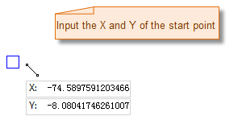
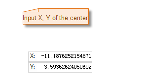

### Introduction

The Polygon command is used to create a polygon. Including arbitrary polygon, regular polygon and orthogonal polygon. Polygon is one of the mostly used region object, it is used to represent closed region object, like administrative area, soil, vegetation and lake. It can also be used to represent some special region features, like island, loop and enclave.

### Basic Steps

**Draw polygon by inputing coordinate values.**

1. Click **Object Operations** > **Drawing** group > **Region** > **Arbitrary Polygon**.
2. Move the cursor to the map window, you can see that the parameter input box will display the coordinate value of the point when the cursor moves. Input the coordinate value of one of the node of the polygon in the input box (you can swap between the two parameter input boxes with the Tab key), press ENTER key to input the start location of the polygon.
3. Move the cursor and input the coordinate value of the second point on the polygon in the parameter box, press Enter to draw the first line segment of the polygon.
4. Input the coordinate value of the next node, press Enter to draw the next line segment.
5. Input the coordinate value of other nodes to draw other line segment on the polygon.
6. Right click to enclose the polygon and finish the current drawing. 

Note: When input value into the editing parameter box, the input box will be locked, that is the value in the parameter input box will not change when the mouse moves, only the input value is displayed; you can switch the focus between the x-coordinate and y-coordinate input box by pressing the Tab key. You can cancel the current parameter input box lock state by pressing the Esc key.

The process of drawing the polygon:

**Draw polygon with length or angle**

1. Click **Object Operations** > **Drawing** group > **Region** > **Polygon (Length, Angle)**.
2. Move the cursor to the map window, you can see that the parameter box will display the coordinate value of the point when the cursor moves. Input the coordinate value of the first node of the polygon in the input box (you can swap between the two parameter input boxes with the Tab key), press ENTER key to input the start location of the polygon.
3. Move the mouse, the length of the line connecting the location of the cursor and the control point and the angle between it and the positive X axis will be displayed in the map window in real time when the cursor moves (you can switch between the two parameter input boxes by pressing the Tab key), input the length and angle, press Enter to finish the drawing of the first line segment of the polygon.
4. Input the length between the next node and the last node, and the angle between their connecting line and the the positive X axis (you can switch between the two parameter input boxes by pressing the Tab key), press Enter to draw the next line segment of the polygon.
5. Repeat the steps above to draw other line segments of the polygon.
6. Right click to finish the current drawing operation.

**Draw regular polygon**

1. Click **Object Operations** > **Drawing** group > **Region** > **Regular Polygon (Length, Angle)**.
2. The Parameter Settings dialog box appears, input the count of edges of the regular polygon to draw. The value should be larger than or equal to 3. The default value is 5.
3. Move the cursor to the map window, you can see that the parameter input box will display the coordinate value of the current cursor when the cursor moves. Input the coordinate value of the center point of the regular polygon in the input box (you can swap between the two parameter input boxes with the Tab key), press Enter key.
4. Move the mouse and input the the radius (length) of the circumcircle of the regular polygon and the angle between the radius and the positive x axis, press Enter to finish the drawing.

The process of drawing the regular polygon:

