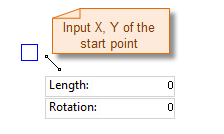

### Introduction

The Line command is used to draw line.

### Basic Steps

**Draw line with start and end points**

1. In the Object Operations tab, click the Line button in the Draw group. Select the line and the cursor appears.
2. Move the cursor to the map window, the coordinate value of the current cursor location will be displayed in the parameter input box when moving the cursor. Input the coordinate of the start point of the line (you can switch between the two parameter input boxes by pressing the Tab key), the press Enter key to confirm the location of the line.
3. Move the cursor and input the coordinate value of the other end point of the line, press Enter.
4. Right click to finish the current drawing operation.

**Draw line with length or angle**

1. In the Object Operations tab, click the Line dropdown list in the Draw group. Select Line(Length, Angle) and the line cursor appears.
2. Move the cursor to the map window, the coordinate value of the current cursor location will be displayed in the parameter input box when moving the cursor. Input the coordinate of the start point of the line (you can switch between the two parameter input boxes by pressing the Tab key), the press Enter key to confirm the location of the line. 

Note: If you press and hold the Shift key, the cursor can only move in directions as 0? 45?or 90? and the angle value can only be 0, 45 or 90. 

3. Move the mouse, the length of the line connecting the location of the cursor and the start point of the line and the angle between it and the positive X axis will be displayed in the map window in real time when the cursor moves (you can switch between the two parameter input boxes by pressing the Tab key), input the length and angle, press Enter to finish the drawing.
4. Right click to finish the current drawing operation.

The process of drawing lines is shown as below:

