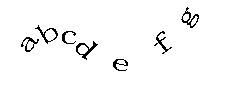

On the Object Operations tab, " **Text** " button on the "Draw" group is used to draw text object on map. The commands in the Draw group are only active if the current layer is an editable text layer or CAD layer.

### Basic Steps

Text Object Drawing  
---  
 
Button | Description | Operations | Illustration  
 --|--|--|--| 
 | Draws normal text | Click the Text button. Click at the position where you want to insert a normal text object and type the content. You can press Enter to start a new line. |   
 | Draws alongline text |  Draw text along line. Click the Alongline Text button. Continuously click on the map to draw a temporary line, right click to finish the path and pop up the Alongline Text dialog box, input the text. Click OK. You can specify a precise path with the precise draw mode.  |   
  
### Note

  * To end drawing, you can: 
    * Right-click anywhere in the map window where any non-text box is located.
    * Click the button in the Text Objects group again.
  * Alongline Text is composed of several sub text objects. A single Chinese character, a continuous alphabet, and a continuous number are treated as a sub-text object. A space character is not counted as a sub object, and is used to separate consecutive characters or numbers. 
  * The direction of Alongline Text is a curve direction, so when creating alongline text, pay attention to the direction of the curve drawn.
  * The default text style for the newly created text dataset is: Arial, font size defaults to 14, the font color is black, transparent background.
  * If you draw a text object, and set the text object style, the last time you set the text style as a style template, applied to subsequent text objects.

