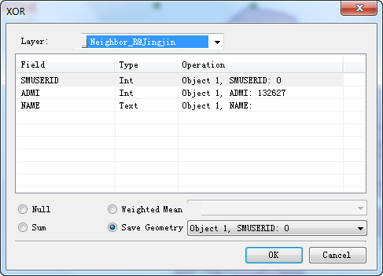

When we perform Intersection, Union, XOR, connection line etc operations on geometric objects, we need to consider the attribute assignment problem of the newly generated object. The application provides an Attribute Assignment Dialog Box making users easily set attributes of result objects. Here we take the Union operation as an example to introduce the Attribute Assignment Dialog Box.

  
  
### Layer

The drop-down list on the right of the Layer tab shows all editable layers in the layer manager. When multiple layers are editable, users need to select a layer to perform the Union operation, i.e. the layer that the Union object will eventually merge into, and the other layer objects remain unchanged.

### List Box

The rest of the list box show names and types of all non-system fields and editable system fields of the union object, as well as operation modes of these fields after the union operation being performed. To modify the operation mode of a field, you can select the field in this list box and then re-select the operation mode in the Operation column.

### Basic Steps

  * **Null** : means the value of this field is Null in the result union object. 
  * **Sum** : means the value of this field in the result union object is the sum of corresponding fields of all union objects. Numeric fields are directly summed. For text fields, the text of multiple objects is automatically connected by SmID order.
  * **Weighted Mean** : means the value (must be a numeric field) of this field in the result union object is the average of corresponding fields of all union objects. It can calculate the simple average or weighted average. The default mode is calculating simple average. 

Select the Weighted Mean radio button, click the right drop-down button and select the No Weighted Field (Mean) item. It means that when weighted fields are not used, a simple average would be calculated, i.e. sum all selected fields of original objects and then divide by the total number of original objects.

If a field is selected in the drop-down menu on the right side of the Weighted Mean radio button, it means this field is used to calculate weighted averaged with the selected filed in the list box.

  * **Save Geometry** : indicates which selected object has the same value in this field as that of the result object. The selected object is highlighted on the map, allowing the user to clearly identify the location of the selected object in the map.

