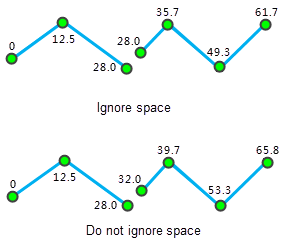

### Introduction

Route object is a set of linear feature objects having X, Y coordinates and linear M values. For example, the milestone on the highway, traffic control departments often use the milestone to mark and manage highway condition, driving speed limit, vehicle accident points. etc. Route object M calibration is adjusting the route M values, making it consistent with the known reference point. For more about route calibration, please refer to [Route Calibration Overview](../../../DynamicSeg/AboutCalibrate.htm).

### Basic Steps

  1. Add the route data into a map window and set the layer to editable. Select one route object that needs M value calibration.
  2. In the Gallery control of Object Editing group on the Object Operations tab, click Calibrate M to display the Calibrate M Value dialog box, as shown below:
  3. The list of the dialog box display route object coordinates and M values. Users can check route node as reference point for M value calibration. The selected route object node will be highlighted in the map and users can directly modify the M value of the reference point in the list.
  4. Method: Calibrate by distance or calibrate by measure. See [Calibrating Route Overview](../../../DynamicSeg/AboutCalibrate.htm) for more information. 
    * By Distance: Calculate M value according to distance of the reference point along the route.
    * By Measure: Calibrate according to measure value of position on the route corresponding to the reference point. When the length and the measure value are not consistent with each other for a route, this method is very suitable for tuning the measure values of the route.
  5. Ignore child object space: Set whether to ignore the space of the child objects. By default, the space will be ignored. The route may contain multiple child objects. If the two child objects are not connected, a gap will occur. If the gap is ignored, the measure values are continuous.

As shown below: M value of the end node of the first child object is the same with the M value of the start node of the second child object if the child object space is ignored; M value of the start node of the second child object is sum of M value of the end node of the first child object and the straight-line distance of the gap between the two child objects if the child object space is not ignored.

  

  6. After setting the parameters, click the Calibrate button to perform the operation. 

###  Note

  1. There should be at least 2 reference points for route calibration. It is suggested that the two reference points nearest to the node that needs calibration. 
  2. If the M value is -9999, the calibration will fail.

###  Related Topics

 [Calibrating Route Overview](../../../DynamicSeg/AboutCalibrate.htm)

 [Calibrating Route](../../../DynamicSeg/CalibrateRoute.htm)

