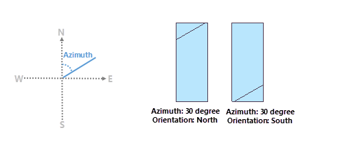
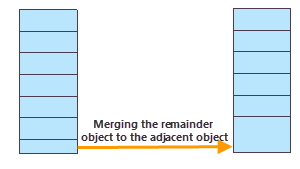

### Instructions

Divides a selected polygon into multiple features that have equal or proportional areas. iDesktop supports dividing data using a projection or plane coordinate system. The feature is mainly used for land distribution.

**Note** : To divide the polygon you selected, the layer is editable where the polygon is saved and its coordinate system isn't a geographic coordinate system.

### Basic steps

1. Select one or more polygons that you want to divide.
2. Click the **Object Operations** tab > **Object Edit** Gallery > **Divide Polygon** button to open the **Divide Polygon** dialog box. 
3. The SmID and Area (square meter) of each selected polygon is listed in the dialog. You can set the dividing conditions for each polygon or several or all polygons.
4. **Divide Orientation** : 
  * **Azimuth** : Specify the clockwise angle between the dividing line and true north.
  * **Orientation** : Specify the dividing direction to determine which side the selected polygon will be cut from. If the azimuth is 0 or 180 degree, the orientation can not be north or south. Else if the azimuth is 90 or 270 degree, the orientation can not be east or west.

As the following pictures show, the polygon have an area of 100000 square meters and the azimuth of 30 degree. When we set the orientation to North (left) and South (right) respectively, we got the following result.

5. **Divide Type** : Specify how you want to divide the selected polygons. 
* **Divide by Area** : Specify the equal area divides the selected object into the specified number of polygon divisions. The Parts Count must be less than or equal to the value of the original area divided by the given **Equal Area**.
* **Divide Polygon Evenly** : Specifying the feature divides the selected polygon evenly into a specified number of polygon divisions. The areas of all polygon divisions are the same. 
6. **Merger the last division with its adjacent division** : When the remaining area is less than the equal area you specified, checking this box can merge the last remaining division with its adjacent division resulting in one division. 

**Note** : Only the last remaining area which is less than or equal to the specified equal area can be merged with its adjacent division.

7. Click **OK** button to perform the operation.

