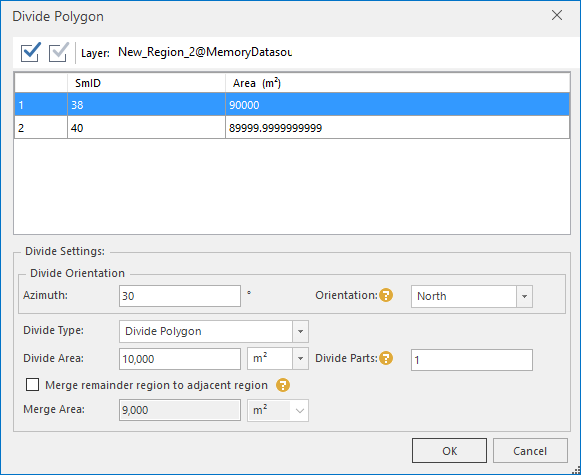
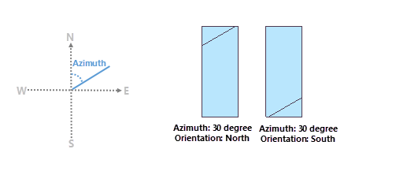
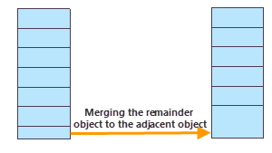

### Instructions

Dividing each selected polygon into several features by specifying the dividing direction and the area of every part or how many parts the polygon will be divided into. Only data using the projection and plane coordinate systems can be divided. The feature is mainly used for land distribution.

**Note** : The "Divide Polygon" button can be worked only when there is at least one object selected in an editable layer and the data can not use a geographic coordinate system.

### Basic steps

  1. Select one or more polygons that you want to divide from an editable layer.
  2. Click the "Object Operations" tab > "Object Editing" Gallery > "Divide Polygon" button to open the "Divide Polygon" dialog box. 
  

  3. The SmID and area of each selected polygon are listed in the dialog. You can set the dividing conditions for every polygon or several or all polygons.
  4. **Divide Orientation** : 
    * **Azimuth** : Specify the clockwise angle between the dividing line and true north.
    * **Orientation** : Specify the dividing direction, that is the selected polygon will be cut from which side. If the azimuth is 0 or 180 degree, the orientation can not be north or south, and if the azimuth is 90 or 270 degree, the orientation can not be east or west.

As following pictures show, the original area of polygon is 100000 square meters, and the azimuth is 30 degree, and the orientation is North (left) and South (right) respectively, and the Divide Area is 10000 square meters and the Divide Part is 1. The result is:

  
---  
  5. **Divide Type** : Specify how to divide the selected polygons. 
    * **According to an area** : Specify the area (the value of parameter "Divide Area") of each result block and how many blocks with the same area (the value of parameter "Divide Parts") you want. The value of Divide Parts must be less than or equal the value of the original area divided by the given dividing area.
    * **According to parts** : The selected object will be divided by the given number (the value of the parameter Divide Parts). 
  6. **Merger the remainder region to adjacent region** : Checking this box means if there is one or more remainder features which will not be divided into more little features, polygons of them whose areas are less than or equal the "Merge Area" you specify will be merged into adjacent polygon. If you do not check the box, the merging operation will not be done. 

**Note** : Only the remainder objects whose areas are less than or equal the merging area can be merged into adjacent polygons.

  

  7. Click "OK" button to perform the operation.

