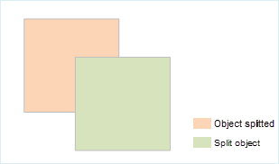

### Introduction

Split the line or region object by the selected object.

It will be valid when a layer is editable and one or more lines/regions on the layer are selected.

### Basic Steps

1. Set the layer the objects to be split are to be editable.
2. Select lines or regions, find Object Operations>Object Editing, and click the Object Split button. Perform split operation.
3. When moving the mouse to the current map window, it prompts "Please select split object", select a line or region object, according to the intersection of two objects, the object will be segmented.

###  Note

* When multi layer editing is started, users can also split lines or regions from multiple editable layers.

