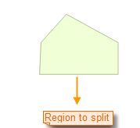
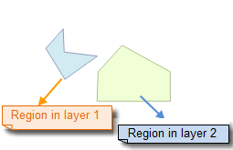

### Instructions

Draw a temporary region to split all regions and lines crossed by the region.

The Region Split button is available only when there is an editable layer in the current map window.

When the multi-layer editing mode is enabled, the temporary split object will split any region object that intersects with it. These objects can be in different layers.

### Basic Steps

1. Set the layer in which you want to split line or region objects editable.
2. In the Object Editing group of the Object Operations tab, click the Region Split button. The current operation mode of the map window is region split or for region objects. 
3. The steps for drawing a temporary region that is used to split region objects are as follows: Move the cursor to the map window and right-click to locate the first point at a right position. Temporary line segments are appeared and moving as you move the mouse. Click the mouse at a right position to locate the next point, and continue to locate the other points by clicking the mouse. 
4. After drawing the temporary split region, right-click the mouse to end the drawing. At this time, the split operation will be performed while the temporary split region disappears.
5. The split result is that the temporary split region splits all editable line or region geometric objects crossed by the region. 
6. To continue to a next split operation, repeat the step 4; If you want to add line or region object from other data to split, add the data and set corresponding layers editable, and then repeat step 4.
7. To end the region split operation state, simply click the Region Split button to make it in an non-locking state. 

### Cut operation:

 

### Note

1. If the multilayer editing function has been enabled, users can split line or region objects in multiple editable layers at a time. 

### Tips

Self-intersection region objects, such as the funnel-shaped region object, do not support the region split operation.

