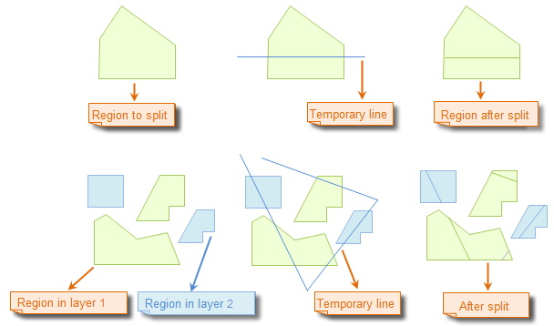
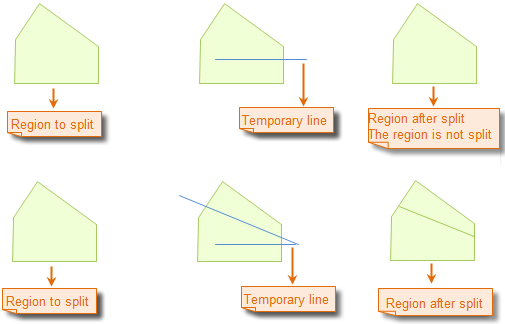

### Description

Draw a temporary polyline to split region objects.

The Line Split command is only active if there is an editable layer in the current map window.

### Basic Steps

1. Set the layer in which the region objects to be split editable. 
2. Select the region objects to be split by clicking the objects while holding down the Shift or Ctrl key, or by dragging a box. When there are region objects selected, only the selected objects will be split when implementing the split operation. However, all objects crossed by the temporary line you draw will be split if no objects are selected. 
3. Click "Object Operations" > "Object Editing" gallery > "Object Operation" group > "Line Split". 
4. Continuously click to draw a temporary polyline on the map. 
5. Right click to finish the polyline and implement the split operation. 
6. The selected region objects are split if you have selected region objects select before drawing the polyline to split; all region objects crossed by the temporary polyline are split if you didn't select region objects before. 
7. Repeat step 4 for another split operation. If you want to split data in another dataset, add the dataset to the map, set the layer referencing the dataset editable, and then repeat the step 4. 
8. Click Line Split again to cancel the function. 

### Illustration:

### Note

1. You can draw a temporary polyline to split region objects in multiple layers at the same time if the multilayer editing function has been enabled. 
2. A region object will only be split if it is completely crossed by the temporary polyline.

### Note

Self intersectant region object, such as the funnelform region object, does not support splitting by drawing line.

