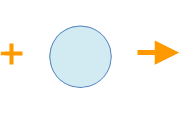
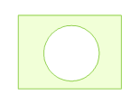

Erase is used to delete the part in the target object that overlap with the erase object.

 |  |   
---|---|---  
Target object | Erasing object | Operation result  
  
### Introduction

  * Available only when line object or region object is selected.
  * The erase functionality only supports line, region and CAD layers.
  * The Target object and the erasing object can't be the same object.
  * The target object can be multiple line objects or region object, but the erasing object must be a region object. 
  * Erase operation supports cross layers. The layer that contains the target object must be editable. In the [Multiple layers editing](MultiLayerEditSet.htm) state, the target layer and the erasing layer can be all editable.
  * Erase operation data standardization has certain requirements. It is recommended that check data topology before the erase operation.

### Basic Steps

  1. When the layer is editable, select one or more target object (region object and line object). 
  2. In the Object Editing group of the Object Operation tab, click the Erase button to perform the erase operation.
  3. The cursor prompts "Please select region object for erasing", select a erasing object, click to finish the erase operation.