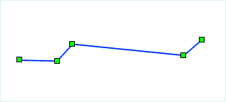
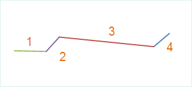

The explode functionality is used to explode the single or multiple line objects to minimum straight line objects.

The minimum straight line object means that object have two nodes or end points, and it is a simple object.

As shown below, the object to explode have 5 nodes (fig1); it can exploded to 4 objects and each object contains 2 nodes. Figure 2 shows the unique value map created with the exploded objects based on SMID.

 |   
---|---  
Fig1: The object before explode | Fig2: The objects after explode  
  
### Introduction

  * The explode functionality supports 2D line layer and CAD layers. This functionality is enabled only when the layer is editable and the line objects are selected.
  * Complex object also support explode operation. The complex object will be resolved and its child objects will be resolved to minimum unit straight line.

### Basic Steps

  1. You can select one or more line objects to explode the layer is editable. 
  2. In the Object Editing group of the Object Operations tab, click the Explode button to perform the execute operation.
  3. After the explode operation, the output window will show how many objects are created. For instance, the line object with smID]=221 created 4 objects after explode.

### Note

For arc and circle objects which have multiple nodes, since each line segment created is very small after explode, they may not be display at the small scale. The application filters the small objects, and the line objects whose length are less than 0.4mm will not be displayed. For the content of the maximum size of the object, see [Setting the Minimum Visible Size](../../../Optimization/MapOptimization/MapOptimization.htm#2) in Optimizing the Map Display.