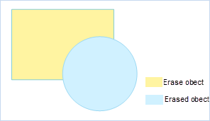
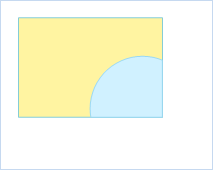

### Introduction

Delete the parts that don't overlap between that target object and the erasing object.

 |   
---|---  
Erasing and erased object | Result  
  
  * Only valid when the selected region is the erasing object.
  * The erased object can be a line or region, but the erasing object should be a region.
  * It supports cross layer operation. The layer that is required to be erased must be editable. In the case of multi layer editing, the erased and erasing layers can be edited at the same time.

### Basic Steps

  1. Choose a region as the erasing object when the layer is editable. 
  2. Find Object Operations tab>Object Editing group, click the Erase External button, and perform Erase External.
  3. The mouse tip "please select the objects to delete", the selected object can a line or region, left click to select the object one by one, and right click to complete the erase operation.