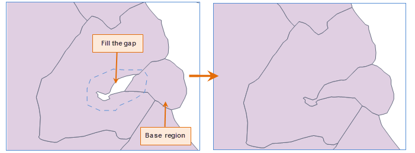

### Instructions

Fill gaps between two objects and the gaps will be merged into one of the two objects.

* To perform the operation, you need to select a basic region.
* You must set your layer editable where the filled object is located in. The operation supports cross-layers.

### Basic Steps

1. Set your layer editable. In the "Object Operations" tab, in the "Object Editing" group and in the Gallery control, click "Fill Gap" button.
2. Select a base region object as the filled object.
3. Draw the filling range. Please note:**
  * The polygon drawing region must be intersected with the filled region object. Otherwise, you need to redraw the range.
  * When the range is intersected with other objects, the overlapped parts in the range will be deleted and other parts in the range will be retained as the filling range.
4. Right click your mouse to finalize the operation. Then the filling range and the base region will be merged into an object.

