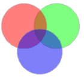

Group objects of the same type or multiple types in the current layer as a compound object.

### Introduction

  * It groups objects with the same or different types together to generate a new compound object. For line and region layers, objects of the same type can be grouped together. For CAD compound layers, different types of objects can be grouped together. 
  * The system field (except SmUserID) values in the attribute information of the newly generated compound object are assigned by the system. The SmUserID and non-system fields will inherit the corresponding information of the object that has the minimal SmID value involving in the group operation. 
  * It supports the group operation for cross layer geometric objects. 
  * It doesn't support to group points.
  * When the number of overlapped regions is even, the overlapped area after being grouped will be white, and is a part of the result. 

### Basic Steps

  1. In an editable layer, select two or more objects.
  2. In the **Object Editing** group on the **Object Operations** tab, click Or do the followings:

Click the right mouse button, and select **Group** command in the pop-up menu.

### The difference between group and union

  * The union operation can only be performed on objects of the same type to generate complex objects; the group operation can be performed on different types of objects to generate compound objects.
  * The union operation cannot be performed on point objects; the group operation can be performed on text objects, and points objects in compound datasets. 

### Note

  * When performing union on the region layer, the overlapped part is in white as a part of the result, not missing. 
  * If one region feature is contained by another region feature when you union them, the result will be a region with island polygon(s). 

### Related Topics

[Merge](Merge)

[Introduction to Object Editing](AboutEdittingGeometry)

