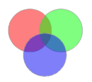
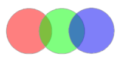

Delete the parts that are not common to two or more objects. Please note that it do not support the intersect between two lines.

### Instructions

  * If the intersection of the region objects involved in an object operation is not an empty set, a simple object of the mutual intersection part will be generated after these objects intersecting each other.  

  
  
  * If the intersection of the region objects involved in an object operation is an empty set, all the original objects will be removed and no object will be generated after these objects intersecting each other.  
    

  
As shown above, all the original objects are removed because the mutual intersection part of the region objects involved in an object operation is an empty set.

  * The attribute description of the newly generated object. It is required to set in the attribute dialog box to save the attribute information of the object as well as the operations for fields. More details about the attribute assignment dialog box and its parameters please refer to the [ attribute assignment dialog box description](AttributeDiag).
  * In CAD layers, when region objects, rectangle objects, circle objects and oblique ellipse objects are involved in an operation, the type of newly generated object is a region object.
  * For the cross layer union, all selected objects in other layers will intersect with the current editable layer. After the operation, only current editable layer object will change, and the other layer objects will not change. When multi-layer editing is enabled, you need can choose objects in the editable layers to perform the intersect operation.

### Basic Steps

  1. In an editable layer, select two or more objects.
  2. In the **Object Operations** group on the **Object Editing** tab, click the Intersect button.
  3. In the attribute assignment dialog box, set the object to be retained. More details about the attribute assignment dialog box for the intersect operation and its parameters please refer to the [ attribute assignment dialog box description](AttributeDiag). 

