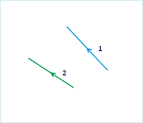

Joins two or multiple editable lines to one line object.

### Introduction

* The function of connecting line objects is applicable to the 2D line layer and CAD layer.
* The function of connecting line objects is available when selected the line objects.
* This operation don't applicable to complex objects and composite objects. Please refer to the [Objects Drawing Overview](../CreateObjects/AboutCreateGeometry) for information about object types.
* Application provides two methods: end to end and connecting the adjacent points. Different connecting method decides the directions of line objects after connecting. 

**End to end** : Connect the start and end points according to the line order. The created line direction is the same as the first line object.

**Connect Adjacent Point** : It connects the first line endpoint to the nearest endpoint of another line object without considering the start and end points. The created line direction is the same as the first line object.

As shown below, Line 1 and Line 2 were connected with different methods:

* The order introduction for line objects. When the lines connect end to end, it needs to determine the order of the line objects, in order to determine the line object direction. The application has two methods to determine the order of line objects. The first one is pressing the Shift key to select multiple line objects. The line objects connect according to the select order.; Another method is dragging a area by the mouse, and connect the objects with the SMID.

### Basic Steps

1. Select one or more editable line objects. 
2. Click the **Object Operations** tab > **Object Edit** Gallery > **Edit Endpoint** > **Connect** button. 
3. Pop up the "Connect Line Object" dialog box. Set the attributes of the new object in this dialog box. 

In the "Connect Line Object" dialog box, you can set parameters for several fields at the same time. The followings is the instruction.

* Layer: The drop down lists all the editable layer in current map. You can select the layers to operate by clicking the right drop-down arrow key.
* Method: iDesktop supports two methods to connect lines that we have mentioned above. Please refer to **Introduction**.
* Field: This area lists the information of all the non system fields and the editable system fields in current editable layer, including name, type and the operations for new object fields. Use the field attributes of the first object.
* Operation: It provides four methods. 
  * Null: This field of new object is null after connecting.
  * Sum: After connecting, the field of new object is the sum of the corresponding fields of the connecting object.
  * Weighted Mean: After connecting, this field of the new object is the weighted mean of all the connecting fields. It need to specify the weighted field. If don't select the weight fields, calculate the average. It means to plus all the fields of source objects, then divide the number of source objects.
  * Save Geometry: You can select which feature attribute you want to keep for the resulting feature.
4. Click "OK" to finish.
