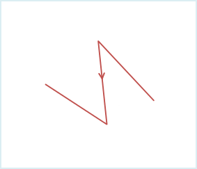
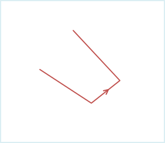
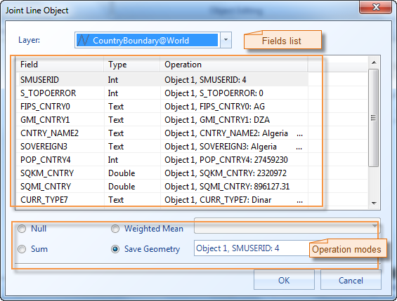

In the status of editable, connect two or multiple single lines into a line object.

### Introduction

  * The function of connecting line objects is applicable to the 2D line layer and CAD layer.
  * The function of connecting line objects is available when selected the line objects.
  * This operation don't applicable to complex objects and composite objects. Please refer to the [Objects Drawing Overview](../CreateObjects/AboutCreateGeometry.htm) for information about object types.
  * Application provides two methods: end to end and connecting the adjacent points. Different connecting method decides the directions of line objects after connecting. 

**End to end** : Connect the start and end points according to the line order. The created line direction is the same as the first line object.

**Connecting the adjacent points** : It doesn't consider the start and end points, and judge the distance between the endpoints of line objects. Connect the first line endpoint to the nearest endpoint of the line object. The created line direction is the same as the first line object.

As shown below, Line 1 and Line 2 were connected with different methods:

 |  |   
---|---|---  
Figure 1: The line object before connecting. | Figure 2: The end to end method | Figure 3: Connecting the adjacent points  
  * The order introduction for line objects. When the lines connect end to end, it needs to determine the order of the line objects, in order to determine the line object direction. The application has two methods to deternine the order of line objects. The first one is pressing the Shift key to select multiple line objects. The line objects connect according to the select order.; Another method is dragging a area by the mouse, and connect the objects with the SMID.

### Basic Steps

  1. When the layer is editable, select one or multiple line objects to connect. 
  2. In "Object Editing" group of "Object Operations", click the Join button to connect the lines.
  3. Pop up the "Joint Line Object" dialog box. Set the attributes of the new object in this dialog box. 

In the "Joint Line Object" dialog box, you can not only set the operation for every field, but also select several fields to set uniformly. The followings is the instruction.

   
Figure: The "Joint Line Object" dialog box  

  * Layer: The drop down lists all the editable layer in current map. You can select the layers to operate by clicking the right drop-down arrow key.

  * Method: Select the connecting method of line objects. It supports two methods: end to end and connecting the adjacent points. Please refer to **Introduction**.

  * Field: This area lists the information of all the non system fields and the editable system fields in current editable layer, including name, type and the operations for new object fields. Use the field attributes of the first object.

  * Operation: It provides four methods. 

      * Null: This field of new object is null after connecting.
      * Sum: After connecting, the field of new object is the sum of the corresponding fields of the connecting object.
      * Weighted Mean: After connecting, this field of the new object is the weighted mean of all the connecting fields. It need to specify the weighted field. If don't select the weight fields, calculate the average. It means to plus all the fields of source objects, then divide the number of source objects.
      * Save Geometry: After connecting, this field of new object is the same as the field of current selected object. You can click the right drop down arrow and select the object attribute value used by new object.

  4. Click "OK" to finish.