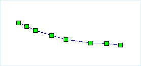

### Introduction

Convert the selected lines to points and save them to a point or CAD dataset.

The **Line to Point** feature save nodes on the selected line object to a point or a CAD dataset as point features. As shown in the following figures, figure 1 is the selected line, while figure 2 is the points saved in as point or CAD dataset.

  
### Basic Steps

  1. Open the line dataset to the map, select one or more line objects when the current line layer can be selected. 
  2. Click **Object Operations** > **Object Edit** > **Conversion** > **Line to Point...**. 
  3. In the dialog box, select the target datasource to put the resulting point dataset which can be new or existing. The parameters in the dialog are set as follows: 
    * **Target Datasource** : the datasource the target dataset is in.
    * **Target Dataset** : the existing point or CAD dataset, to save the new points.
    * **New Dataset** : check it to set the new dataset name and save the points in it.
    * **Delete Source Object** : If the layer the choosed lines are in is editable, you can check the "Delete source object" to delete the selected lines in the source dataset.
  4. Click **OK** to finish.

