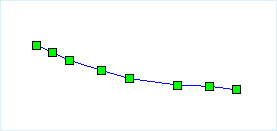
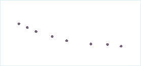

### Introduction

Convert the selected lines to points, and save them to a point dataset or a CAD dataset.

When a line object is converted to points, all nodes in the line object can be saved directly to the points, as shown in the following diagram, figure 1 is the line object to be converted, figure 2 is the points saved in the point or CAD dataset.

 |   
---|---  
Figure 1: the line object to be converted | Figure 2: result points  
  
### Basic Steps

  1. Open the line dataset to the map, select one or more line objects when the current line layer can be selected. 
  2. Click **Object Operations** > **Object Editing.** Click the Line->Point button, pop up the **Line - > Point** dialog box as shown in the figure below:  

  3. In the dialog box, select the target datasource and dataset of the new points. The result data is stored in two ways: save it to the existing dataset or create a new point dataset to save. The parameters in the dialog are set as follows: 
    * Target datasource: the datasource the target dataset is in.
    * Target dataset: the existing point or CAD dataset, to save the new points.
    * Create dataset: check it to set the new dataset name and save the points in it.
    * Delete source object: If the layer the chose lines are in is editable, you can check the "Delete source object" to delete the selected lines in the source dataset.
  4. Click OK to finish.