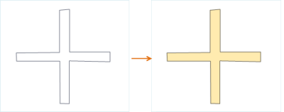
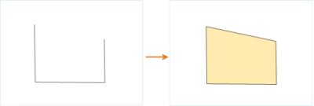

### Introduction

Convert the selected lines to regions, and save them to a region dataset or a CAD dataset.

When converting line objects into region objects, the closed line object will
be converted as the region boundary; the non closed line object will be
connected end-to-end, then converted to the region boundary. As shown in the
following figure, figure 1 is to convert the closed line object to the region
object, and the figure 2 is to convert the non closed line object to the
region object.

### Basic Steps

1. Open the line dataset to the map, select one or more line objects when the current line layer can be selected. 
2. Click **Object Operations** > **Object Edit** > **Conversion** > **Line to Region...**. 
3. In the dialog box, select the target datasource and dataset of the new regions. The result data is stored in two ways: save it to the existing dataset or create a new region dataset. The parameters in the dialog are set as follows: 
  * **Target Datasource** : the datasource the target dataset is in.
  * **Target Dataset** : the existing region or CAD dataset, to save the new regions.
  * **New Dataset** : check it to set the new dataset name and save the regions in it.
  * **Delete Source Object** : If the layer where the selected regions locate is editable, you can check the "Delete source object" to delete the selected regions in the source dataset.
4. Click **OK** to finish.

### Note

1. One line object will be converted to one region object. The grouped line objects will be converted to a grouped region objects.
2. A straight line can not be converted to a region object, if you choose a straight line, then the output window will prompt that it fails to convert the straight line.

