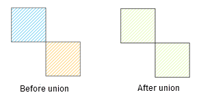
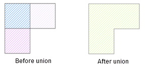
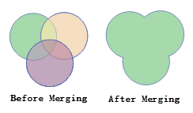
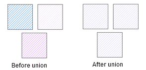

In practice, we may need to merge two or more objects as one object.

Merging supports region objects and line objects. If the merged object is a line object, the merge can be successful only if there are overlapping nodes or segments between the lines.

### Instructions

During the union operation, there will be a variety of special circumstances. 
These cases are described separately as follows.

  1. **Current layer is region layer.**
    * If the region objects involved in an object operation intersect at points, then these region objects will be merged into a complex region object (The figure below shows the generation of a complex region object with two sub-objects).  
      

    * If the region objects involved in an object operation intersect at lines, adjacent edges of these region objects will disappear, and the objects will be merged into a simple region object.  
      

    * If the region objects involved in an object operation intersect at regions, these region objects will be merged into a simple region object.  
      

    * If the region objects involved in an object operation neither intersect nor adjacent to each other, a complex region object will be generated after the union operation. (The figure below shows the generation of the complex object with three sub region objects).  
      

  2. **Current layers are compound layers**
    * In CAD layers, when line objects, curve objects, elliptic arc objects and arc objects are involved in an operation, the type of the newly generated object will be a line object; when region objects, rectangle objects, circle objects and oblique ellipse objects are involved in an operation, the type of the newly generated object will be a region object.
  3. **Cross layer union**
    * When cross layer union, all selected objects in other layers will merge with current editable layer. After the operation, only current editable layer object will change, and the other layer objects will not change. When multi-layer editing is enabled, you need to choose an editable layer to perform the union operation.

### Basic Steps

  1. In an editable layer, select two or more objects.
  2. In the **Object Editing** group on the **Object Operations** tab, click the Union button to bring out the attribute assignment dialog box.
  3. In the attribute assignment dialog box, set the object to be retained. More details about the attribute assignment dialog box for the union operation and its parameters please refer to the [ attribute assignment dialog box description](AttributeDiag.htm). 
  4. Click OK to finish.

###  Related Topics

 [Group](Group.htm)

 [Introduction to Object Editing](AboutEdittingGeometry.htm)

