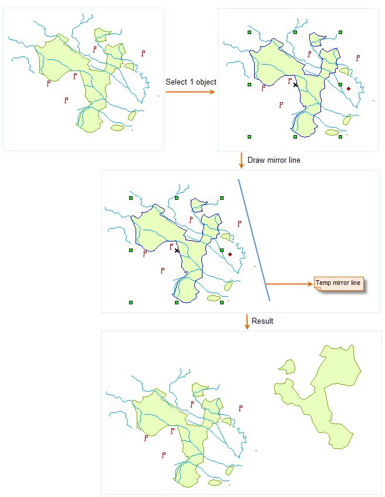
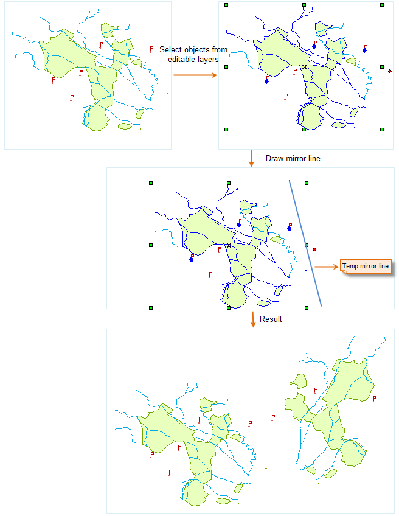

### Description

Duplicate mirror images of the selected non-text objects.

### Basic Steps

  1. In an editable layer, select one or more objects (except text objects) to mirror.
  2. Click the **Object Operations** tab > **Object Edit** Gallery > **Mirror** button. 
  3. At now, a prompt "Please draw a mirror line" appears. Then you specify the first point, and after the second point are confirmed, the mirror operation is done.
  4. Repeat steps 1 through 3 to implement another mirror operation.

  
  
### Note

You can mirror objects in multiple layers at the same time if the multilayer editing function has been enabled.

  
