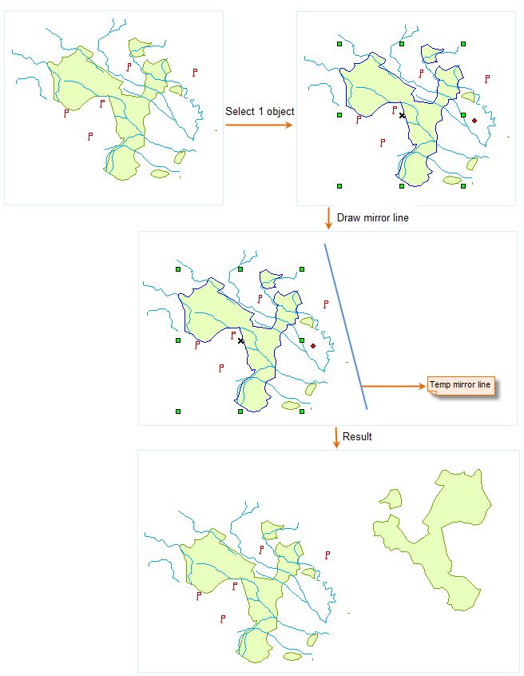
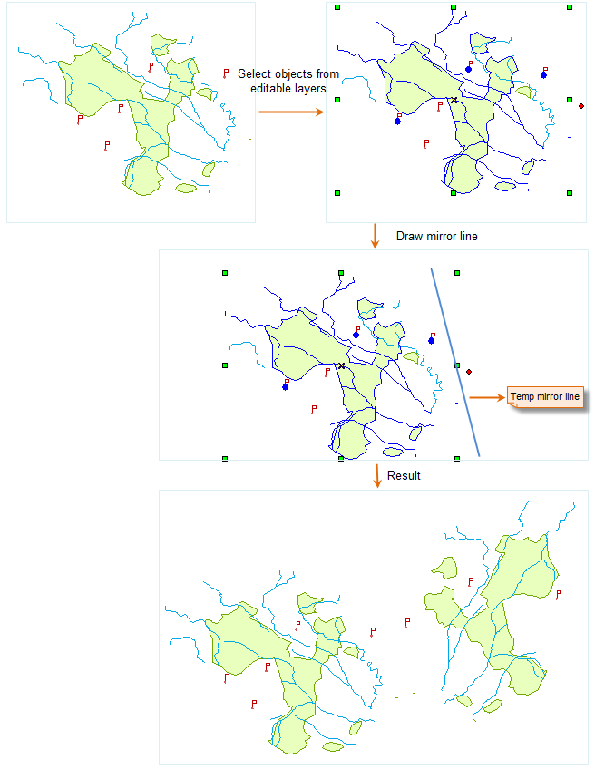

### Description

Duplicate mirror images of the selected non-text objects.

### Basic Steps

  1. In an editable layer, select one or more objects (except text objects) to mirror.
  2. Click the Mirror in the Object Editing group under the Object Operations tab. 
  3. At now, a prompt "Please draw a mirror line" appears. Then you specify the first point, and after the second point are confirmed, the mirror operation is done.
  4. Repeat steps 1 through 3 to implement another mirror operation.

  
 
Figure: Mirror operation 1  
  
### Note

You can mirror objects in multiple layers at the same time if the multilayer editing function has been enabled.

  

Figure: Mirror operation 2  