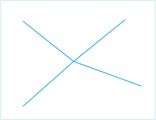

The point adjustment can connect the adjacent lines. The point adjustment is to conduct the adjustment operation for all the nodes in the range. The result is to create a new node and delete all the circled nodes. Connect the line object in the new node. Note: The connection is in the node and it doesn't form a n object.

Shown as the following figure, select the endpoints of the contiguous four lines (the nodes in blue circle), and conduct the adjustment operation to them. The result is that all the nodes are deleted and create a new node. The new node connects with the other nodes in the four lines and the results are as follows:

 |   
---|---  
Circle the nodes that attend the operation | The result of point adjustment  
  
### Introduction

  * The function of point adjustment is applicable to the line layer and CAD layer. 
  * When the range of circling is large, the point operation is unavailable for the line objects that fall into the temporary circle range.

### Basic Steps

  1. When the layer is editable, in "Object Editing" group of "Object Operations", click the Point Adjustment button to perform the point adjustment.
  2. Move the mouse into the map window, and prompt the "Please circle select vertexes for adjustment". Draw a temporary circle in the map window and make the node that attends the adjustment fall into the circle.
  3. Click the mouse to conduct the point adjustment for the selected points.
  4. Click right mouse button to cancel current operation.